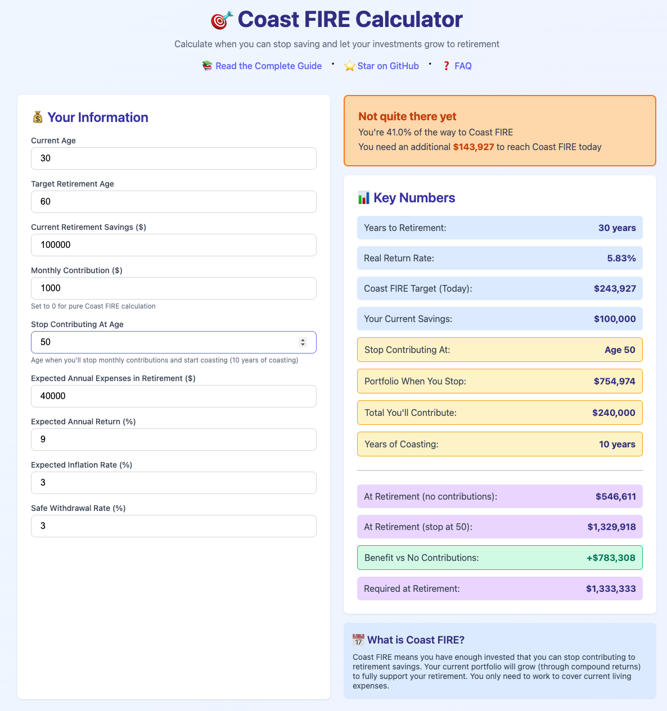
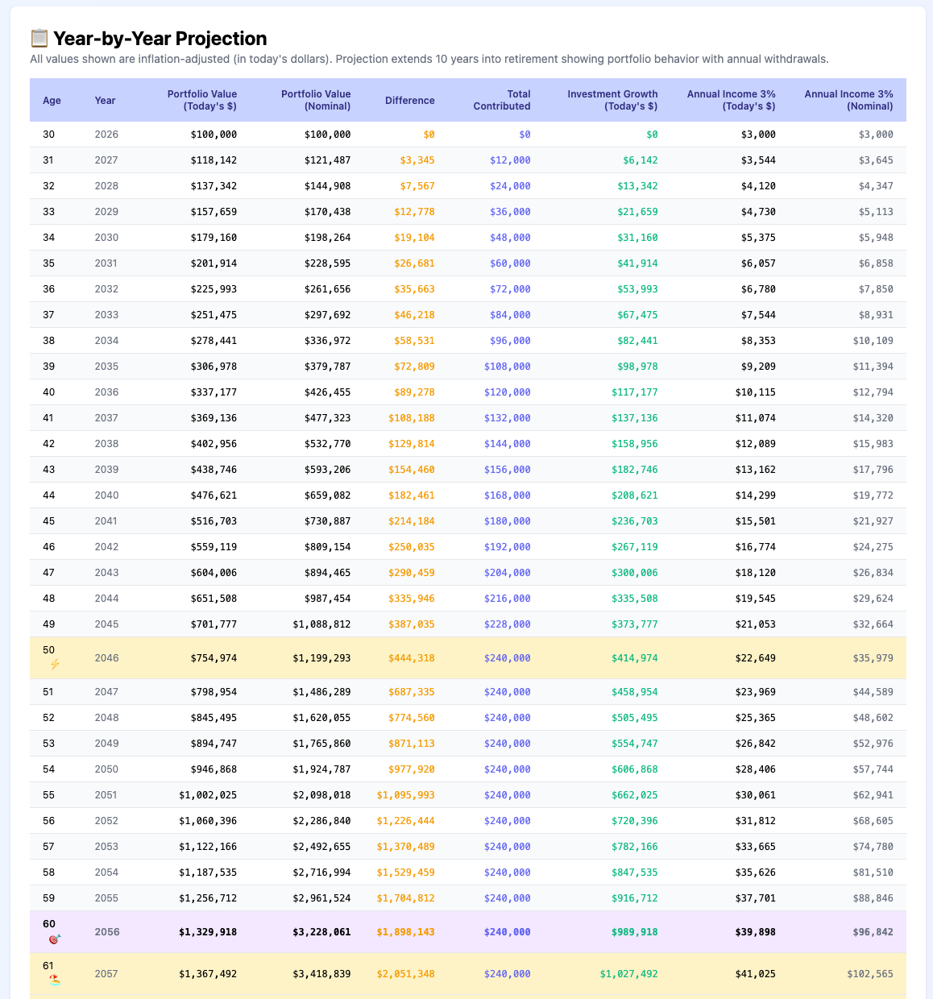

# 🎯 Coast FIRE Calculator

[](https://opensource.org/licenses/MIT)
[](https://joanpalin.github.io/coast-fire-calculator/)
[](https://github.com/joanpalin/coast-fire-calculator/issues)
[](https://github.com/joanpalin/coast-fire-calculator/stargazers)

**Calculate when you can stop saving for retirement and let compound interest do the rest.**

A comprehensive, free, and open-source Coast FIRE calculator that helps you understand when you've saved enough to stop contributing to retirement accounts. Your existing investments will grow to cover your retirement needs—you just need to work enough to cover current expenses.

[**🚀 Try the Live Calculator**](https://joanpalin.github.io/Coast-FIRE-Calculator/) | [**📚 Read the Complete Guide**](docs/) | [**💬 Join Discussion**](https://github.com/joanpalin/coast-fire-calculator/discussions)

---

## ✨ What is Coast FIRE?

**Coast FIRE** (Financial Independence, Retire Early) means you've saved enough that you can **stop contributing to retirement** and let your investments grow through compound interest until traditional retirement age (60-65).

**Traditional FIRE vs Coast FIRE:**
- **Traditional FIRE**: Save aggressively for 15-20 years → Retire completely at 40-50
- **Coast FIRE**: Save aggressively for 5-10 years → Work for expenses only → Retire at 60-65

**The Benefits:**
- ✅ Financial freedom years earlier
- ✅ Take lower-paying passion jobs
- ✅ Work part-time or freelance
- ✅ Take career breaks and sabbaticals
- ✅ Significantly less financial stress

---

## 📸 Preview





*Interactive calculator with real-time projections, beautiful charts, and detailed year-by-year breakdowns*

---

## 🚀 Quick Start

### Option 1: Use Online (Recommended)
Visit the live calculator: **[https://joanpalin.github.io/coast-fire-calculator/](https://joanpalin.github.io/Coast-FIRE-Calculator/)**

### Option 2: Run Locally
1. Clone this repository:
```bash
   git clone https://github.com/joanpalin/coast-fire-calculator.git
```
2. Open `index.html` in your web browser
3. Start calculating!

**No installation, no dependencies, no tracking—just pure HTML, CSS, and JavaScript.**

---

## 🎯 Features

### 💰 Comprehensive Calculations
- **Coast FIRE Status**: Instantly see if you've reached Coast FIRE
- **Multiple Scenarios**: Test different contribution plans and stop ages
- **Inflation-Adjusted**: All calculations use real (inflation-adjusted) returns
- **Flexible Inputs**: Customize every parameter to match your situation

### 📊 Visual Projections
- **Interactive Charts**: See your portfolio growth over time with Chart.js
- **Multiple Scenarios**: Compare stopping now vs continuing to save
- **Retirement Sustainability**: Visualize portfolio behavior with withdrawals

### 📋 Detailed Analysis
- **Year-by-Year Table**: See exact portfolio values at every age
- **Real vs Nominal Values**: Understand the impact of inflation
- **Investment Growth Tracking**: See how much comes from contributions vs compound interest
- **Withdrawal Rate Analysis**: Test different safe withdrawal rates (3.5%, 4%, 5%)

### 🎓 Educational Content
- **Comprehensive Guide**: 10,000+ word guide explaining FIRE concepts
- **Real-World Examples**: Practical scenarios and case studies
- **Pro Tips**: Expert advice for maximizing your Coast FIRE journey
- **Common Mistakes**: Learn what to avoid

---

## 📚 Documentation

- **[Introduction to FIRE & Coast FIRE](docs/introduction.md)** - Understanding the concepts
- **[Calculator Field Guide](docs/calculator-guide.md)** - What each input means
- **[How to Use the Calculator](docs/how-to-use.md)** - Step-by-step tutorials
- **[Understanding Your Results](docs/understanding-results.md)** - Interpreting charts and tables
- **[Testing Different Scenarios](docs/scenarios.md)** - Scenario planning exercises
- **[FAQ & Tips](docs/faq.md)** - Common questions answered
- **[Additional Resources](docs/resources.md)** - Books, communities, and tools

---

## 🎮 Example Use Cases

### 1. **"Have I Saved Enough?"**
Enter your current savings and see if you can stop contributing immediately.

### 2. **"When Can I Stop Saving?"**
Input your monthly contributions and find out when you'll reach Coast FIRE.

### 3. **"Can I Take a Career Break?"**
Test scenarios where you stop saving for 5 years to travel or start a business.

### 4. **"Should I Switch to a Lower-Paying Job?"**
See how reducing contributions affects your retirement timeline.

---

## 🛠️ Technology

This calculator is built with:
- **Pure HTML/CSS/JavaScript** - No frameworks, no build process
- **Chart.js** - Beautiful, responsive charts
- **Vanilla JavaScript** - Fast, lightweight, and universally compatible
- **Progressive Enhancement** - Works everywhere, even without JavaScript

**Privacy First:**
- ✅ No data collection
- ✅ No cookies
- ✅ No tracking
- ✅ All calculations happen in your browser
- ✅ Your financial data never leaves your device

---

## 🤝 Contributing

Contributions are welcome! Whether it's:
- 🐛 Bug fixes
- ✨ New features
- 📝 Documentation improvements
- 🌍 Translations
- 💡 Suggestions

Please read [CONTRIBUTING.md](CONTRIBUTING.md) for details on our code of conduct and the process for submitting pull requests.

### Ideas for Contributions
- Add currency support for non-USD
- Add export to PDF functionality
- Create mobile app version
- Add scenario comparison side-by-side
- Implement Monte Carlo simulations
- Add Social Security estimator
- Create printable reports

---

## 📊 Calculation Methodology

### Key Formulas

**Real Return Rate:**
```
Real Return = ((1 + Nominal Return) / (1 + Inflation)) - 1
```

**Coast FIRE Target:**
```
Coast FIRE Target = Required Portfolio / (1 + Real Return)^Years to Retirement
```

**Future Value with Contributions:**
```
FV = PV × (1 + r)^n + PMT × (((1 + r)^n - 1) / r)
```

**Safe Withdrawal:**
```
Annual Income = Portfolio Value × Withdrawal Rate
```

### Assumptions
- Returns are compounded annually
- Contributions are made monthly
- All projections are in real (inflation-adjusted) terms
- Safe withdrawal rate follows the Trinity Study methodology
- Sequence of returns risk is not explicitly modeled

---

## 📖 Educational Philosophy

This calculator is designed to be:
1. **Educational First**: Understand the concepts, not just the numbers
2. **Transparent**: See all calculations and assumptions
3. **Conservative**: Use realistic assumptions, not optimistic ones
4. **Flexible**: Test multiple scenarios to find your path
5. **Empowering**: Give you confidence in your financial decisions

---

## 🌟 Success Stories

> "This calculator helped me realize I reached Coast FIRE at 32! I switched to a 3-day work week and have never been happier." - *Sarah M.*

> "The detailed guide taught me more about investing than any book. I now understand compound interest viscerally." - *James L.*

> "I used the scenario planning to negotiate a 6-month sabbatical. Seeing the actual numbers made me confident it wouldn't derail my retirement." - *Emma K.*

*(Want to share your story? Open an issue with the "success-story" label!)*

---

## 📜 License

This project is licensed under the MIT License - see the [LICENSE](LICENSE) file for details.

**TL;DR:** You can use, modify, and distribute this calculator freely, even for commercial purposes. Just keep the license notice.

---

## 🙏 Acknowledgments

- **Vicki Robin & Joe Dominguez** - "Your Money or Your Life" pioneers
- **The FIRE Community** - r/financialindependence, r/coastFIRE
- **The Trinity Study** - Foundation for the 4% rule
- **Chart.js Team** - Beautiful, accessible charts
- **Everyone who contributed** - See [contributors](https://github.com/joanpalin/coast-fire-calculator/graphs/contributors)

---

## 📞 Support & Community

- **📖 Documentation**: [Read the docs](docs/)
- **💬 Discussions**: [GitHub Discussions](https://github.com/joanpalin/coast-fire-calculator/discussions)
- **🐛 Bug Reports**: [Open an issue](https://github.com/joanpalin/coast-fire-calculator/issues)
- **💡 Feature Requests**: [Open an issue with "enhancement" label](https://github.com/joanpalin/coast-fire-calculator/issues)

---

## ⚠️ Disclaimer

This calculator is for educational and informational purposes only. It is not financial advice. Please consult with a qualified financial advisor before making investment decisions. Past performance does not guarantee future results. Your individual circumstances may vary significantly from the assumptions used in this calculator.

---

## 🗺️ Roadmap

- [ ] Add Monte Carlo simulation option
- [ ] Create printable PDF reports
- [ ] Add multiple currency support
- [ ] Implement scenario comparison view
- [ ] Add Social Security integration
- [ ] Create mobile app version
- [ ] Add pension calculator integration
- [ ] Implement tax optimization strategies
- [ ] Add HSA (Health Savings Account) tracking
- [ ] Create video tutorials

---

<div align="center">

**⭐ Star this repo if you found it helpful!**

**Made with ❤️ for the FIRE community**

[Report Bug](https://github.com/joanpalin/coast-fire-calculator/issues) · [Request Feature](https://github.com/joanpalin/coast-fire-calculator/issues) · [Contribute](CONTRIBUTING.md)

</div>
```
